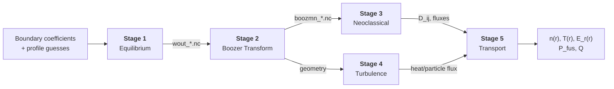

# StellaForge

End-to-end stellarator design pipeline connecting equilibrium, Boozer transform, neoclassical transport, turbulence, and profile evolution in containerized, orchestrated stages. Currently in the **specification phase** -- see [Progress](#progress) below.



Stages 3 and 4 run in parallel. Each stage is independently swappable (see [architecture](docs/architecture.md#swappability-patterns)).

## Quick Reference

| Resource                                | Location                                                       |
| --------------------------------------- | -------------------------------------------------------------- |
| Stage I/O specs                         | [`docs/stage{N}-{name}/spec.md`](docs/)                        |
| Pipeline architecture & design          | [`docs/architecture.md`](docs/architecture.md)                 |
| Phase 1 & 2 step-by-step checklist      | [`docs/contributor-guide.md`](docs/contributor-guide.md)       |
| Snakemake & workflow engineer spec      | [`docs/workflow-integration.md`](docs/workflow-integration.md) |
| Physics equations & I/O contracts (TeX) | [`stellarator_workflow/`](stellarator_workflow/)               |
| Coding standards                        | [`CLAUDE.md`](CLAUDE.md)                                       |

## Pipeline Stages

| Stage | Physics | JAX Primary | Alternatives |
|-------|---------|-------------|--------------|
| 1. Equilibrium | Ideal-MHD force balance | [vmec_jax](https://github.com/uwplasma/vmec_jax), [DESC](https://github.com/PlasmaControl/DESC) | [VMEC++](https://github.com/proximafusion/vmecpp) |
| 2. Boozer Transform | Coordinate transform | [booz_xform_jax](https://github.com/uwplasma/booz_xform_jax) | [BOOZ_XFORM](https://github.com/hiddenSymmetries/booz_xform) |
| 3. Neoclassical | Effective ripple, drift-kinetic, monoenergetic | [NEO_JAX](https://github.com/uwplasma/NEO_JAX), [sfincs_jax](https://github.com/uwplasma/sfincs_jax), [MONKES](https://github.com/f0uriest/monkes) | [NEO](https://github.com/PrincetonUniversity/STELLOPT), [SFINCS](https://github.com/landreman/sfincs) |
| 4. Turbulence | Gyrokinetic equation | [SPECTRAX-GK](https://github.com/uwplasma/SPECTRAX-GK) | [GX](https://bitbucket.org/gyrokinetics/gx), [GENE](https://genecode.org) |
| 5. Transport | Profile evolution, power balance | [NEOPAX](https://github.com/uwplasma/NEOPAX) | [Trinity3D](https://bitbucket.org/gyrokinetics/t3d) |

## Where to Put Code

**Phase 1** work goes into the stage spec docs (`docs/stage{N}-{name}/spec.md`) -- the "OWNER COMPLETES" sections.

**Phase 2** introduces these directories:

```
containers/
├── base/
│   ├── Dockerfile.cpu              # Shared CPU base image (python:3.11 + scientific stack)
│   └── Dockerfile.gpu              # Shared GPU base image (nvidia/cuda:12.x + JAX[cuda])
└── stage{N}-{name}/
    ├── Dockerfile                  # FROM stellaforge/base-{cpu|gpu}
    ├── .dockerignore
    ├── requirements.txt            # Upstream package pins (commit SHAs)
    └── scripts/
        └── run.py                  # Container ENTRYPOINT (also runnable locally)

tests/stage{N}-{name}/             # Unit, regression, and integration tests
input/                              # Reference input data (boundary coefficients, profiles)
versions.yaml                      # Pinned upstream commits, JAX, Python, CUDA versions
```

Details on each file in the [Contributor Guide](docs/contributor-guide.md).

## Workflow

1. Branch from `main` (e.g., `stage1-phase1`)
2. Work through the phase checklist in the [Contributor Guide](docs/contributor-guide.md)
3. Open a PR when deliverables are ready
4. After review and merge, the corresponding item below gets checked off

## Progress

### Phase 1: Document & Run

Install the JAX code, validate the I/O spec, document the API and convergence behavior, write example scripts, set up W&B tracking. Full checklist in the [Contributor Guide](docs/contributor-guide.md#phase-1-document--run).

- [ ] Stage 1 -- Equilibrium (vmec_jax)
- [ ] Stage 2 -- Boozer Transform (booz_xform_jax)
- [ ] Stage 3 -- Neoclassical (NEO_JAX, sfincs_jax, MONKES)
- [ ] Stage 4 -- Turbulence (SPECTRAX-GK)
- [ ] Stage 5 -- Transport (NEOPAX)

### Phase 2: Containerize & Test

Dockerfile, entry-point script, and unit/regression/integration tests per stage. Full checklist in the [Contributor Guide](docs/contributor-guide.md#phase-2-containerize--test).

- [ ] Base images -- CPU and GPU Dockerfiles (`containers/base/`)
- [ ] `versions.yaml` -- pinned upstream commit SHAs, JAX, Python, CUDA versions
- [ ] Stage 1 -- container + tests
- [ ] Stage 2 -- container + tests
- [ ] Stage 3 -- container + tests
- [ ] Stage 4 -- container + tests
- [ ] Stage 5 -- container + tests

### Phase 3: Integrate

Snakemake DAG, end-to-end tests, and publishing. Details in the [Workflow Integration spec](docs/workflow-integration.md).

- [ ] `config.yaml` + Snakemake DAG
- [ ] Swappability patterns (single-stage, multi-stage, end-to-end)
- [ ] End-to-end integration tests
- [ ] Pipeline-level W&B aggregation
- [ ] Docker Hub image publishing

## Planned Usage

<details>
<summary>What running the pipeline will look like (not yet available)</summary>

```bash
# Clone and initialize
git clone https://github.com/RKHashmani/StellaForge.git
cd StellaForge
git submodule update --init --recursive

# Run the full pipeline
snakemake --sdm docker --configfile config.yaml

# Or pull prebuilt containers and run individual stages
docker pull stellaforge/stage1-equilibrium:latest
docker run -v ./input:/data/input -v ./runs:/data/output stellaforge/stage1-equilibrium
```

</details>

## License

[MIT](LICENSE)
