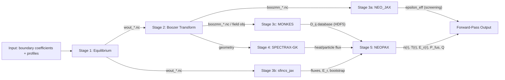

# StellaForge Workflow Integration Specification

## Overview

This document is the specification for the StellaForge workflow engineer -- the person responsible for building the Snakemake orchestration layer that connects the 5 containerized pipeline stages into an end-to-end forward pass.

**Your role:** You build the DAG, config system, and integration tests AFTER all 5 stage owners have completed Phase 2 (containerization and testing). Your inputs are 5 working Docker containers, each with documented I/O contracts in their stage spec.

**Key principle:** Stages communicate exclusively through files on a shared volume. There is no adapter protocol or wrapper layer. Snakemake rules define which files connect which stages.

## DAG Architecture

### Forward-Pass DAG

The forward pass is NOT a simple linear chain. Stages 3 and 4 run in parallel after Stage 2:



**Parallelism opportunities:**
- Stage 3a (NEO_JAX) and 3c (MONKES) can run in parallel after Stage 2; 3b (sfincs_jax) can start after Stage 1
- Stage 4 (SPECTRAX-GK) can run in parallel with all of Stage 3
- Stage 5 (NEOPAX) waits for Stage 3c (MONKES) and Stage 4 (SPECTRAX-GK)

**Important:** Stage 3a (NEO_JAX) produces epsilon_eff, which is a screening diagnostic only. It does NOT feed into Stage 5. Do not wire it as a dependency for Stage 5.

## Snakemake Rule Design

### One Rule Per Stage-Implementation Pair

Each stage has rules for each supported implementation. Only the config-selected rule fires.

Example rule structure:

```python
rule equilibrium_vmec_jax:
    input:
        boundary="{run_dir}/input/boundary.json",
        profiles="{run_dir}/input/profiles.json"
    output:
        wout="{run_dir}/stage1_equilibrium/wout_{name}.nc"
    container:
        "docker://stellaforge/stage1-equilibrium:{version}"
    resources:
        mem_mb=config["stage1"]["resources"]["memory"],
        gpu=config["stage1"]["resources"].get("gpu", 0)
    shell:
        "python /app/scripts/run.py --input {input.boundary} --output {output.wout}"


rule equilibrium_desc:
    input:
        boundary="{run_dir}/input/boundary.json",
        profiles="{run_dir}/input/profiles.json"
    output:
        wout="{run_dir}/stage1_equilibrium/wout_{name}.nc"
    container:
        "docker://stellaforge/stage1-equilibrium-desc:{version}"
    resources:
        mem_mb=config["stage1"]["resources"]["memory"]
    shell:
        "python /app/scripts/run.py --input {input.boundary} --output {output.wout}"
```

### Config-Driven Rule Selection

Use Snakemake's `ruleorder` or conditional `if` blocks to select the active implementation:

```python
# In Snakefile
if config["stage1"]["implementation"] == "vmec_jax":
    ruleorder: equilibrium_vmec_jax > equilibrium_desc
elif config["stage1"]["implementation"] == "desc":
    ruleorder: equilibrium_desc > equilibrium_vmec_jax
```

Or use a dispatcher rule that delegates to the correct implementation based on config.

### Stage 3: Fan-Out Rules

Stage 3 has three independent sub-stages. Each gets its own rule:

```python
rule neoclassical_neo_jax:
    input:
        boozmn="{run_dir}/stage2_boozer/boozmn_{name}.nc"
    output:
        neo_out="{run_dir}/stage3_neoclassical/neo_out_{name}.dat"
    ...

rule neoclassical_sfincs_jax:
    input:
        wout="{run_dir}/stage1_equilibrium/wout_{name}.nc"
    output:
        sfincs_out="{run_dir}/stage3_neoclassical/sfincsOutput_{name}.h5"
    ...

rule neoclassical_monkes:
    input:
        boozmn="{run_dir}/stage2_boozer/boozmn_{name}.nc"
    output:
        dij_db="{run_dir}/stage3_neoclassical/dij_database_{name}.h5"
    ...
```

These three rules have no dependencies on each other, so Snakemake will schedule them in parallel if resources allow.

## Swappability Patterns

### Pattern 1: Single-Stage Swap

Change one implementation without affecting the rest of the pipeline.

**How:** Change `config["stageN"]["implementation"]` in `config.yaml`. The corresponding Snakemake rule fires. The output file format MUST match what downstream stages expect.

**Example:** Swap Stage 4 from SPECTRAX-GK to GX:
```yaml
stage4:
  implementation: gx  # was: spectrax_gk
```

**Constraint:** The GX rule must produce output files that Stage 5 can consume. Since GX and SPECTRAX-GK produce the same logical outputs (heat/particle flux), the file format bridge must be documented.

### Pattern 2: Multi-Stage Swap

A single combined rule replaces multiple individual stage rules.

**How:** Add a combined rule that produces all the output files of the replaced stages. Use config to activate it.

**Example:** DESC can do both equilibrium and Boozer transform internally:
```python
rule equilibrium_boozer_desc:
    input:
        boundary="{run_dir}/input/boundary.json"
    output:
        wout="{run_dir}/stage1_equilibrium/wout_{name}.nc",
        boozmn="{run_dir}/stage2_boozer/boozmn_{name}.nc"
    container:
        "stellaforge-stage12-desc:{version}"
    shell:
        "python -m desc_combined --input {input.boundary} --wout {output.wout} --boozmn {output.boozmn}"
```

Config:
```yaml
stage1:
  implementation: desc_combined
stage2:
  implementation: desc_combined  # signals that this is handled by the combined rule
```

### Pattern 3: End-to-End Swap

The entire pipeline DAG is replaced by a single rule.

**How:** A single rule that takes the pipeline input and produces the final output, bypassing all intermediate stages.

```python
rule full_pipeline_jax:
    input:
        boundary="{run_dir}/input/boundary.json",
        profiles="{run_dir}/input/profiles.json"
    output:
        results="{run_dir}/stage5_transport/results_{name}.h5"
    container:
        "docker://stellaforge/full-jax:{version}"
    shell:
        "python /app/scripts/run.py --input {input.boundary} --output {output.results}"
```

### How to Register a New Implementation

To add a new implementation for an existing stage:

1. Write a Snakemake rule that produces the same output files (same names, same format) as existing rules for that stage
2. Add the implementation name to the config schema
3. Add the config-driven selection logic
4. Write an integration test verifying the new implementation's output is consumed correctly by downstream stages
5. Document the new implementation in the relevant stage's spec

## Pipeline Configuration

### `config.yaml` Schema

```yaml
# StellaForge Pipeline Configuration

# Run identification
run_name: "example_qa_run"
run_dir: "runs/{run_name}"

# Input data
input:
  boundary: "input/landreman_paul_qa.json"
  profiles: "input/initial_profiles.json"

# Stage implementations
stage1:
  implementation: vmec_jax  # options: vmec_jax, desc, vmecpp
  params:
    ns: [25, 49, 99]
    mpol: 12
    ntor: 12
    ftol: 1.0e-12
  resources:
    memory: "8G"
    gpu: false

stage2:
  implementation: booz_xform_jax  # options: booz_xform_jax, booz_xform
  params:
    mboz: 32
    nboz: 32
  resources:
    memory: "4G"

stage3:
  implementation: jax  # options: jax (runs NEO_JAX + sfincs_jax + MONKES), sfincs_only, monkes_only
  neo:
    enabled: true
    params: {}
  sfincs:
    enabled: true
    params: {}
  monkes:
    enabled: true
    params:
      n_rho: 10
      n_nu: 20
      n_er: 15
  resources:
    memory: "16G"

stage4:
  implementation: spectrax_gk  # options: spectrax_gk, gx, gene
  params: {}
  resources:
    memory: "16G"
    gpu: true

stage5:
  implementation: neopax  # options: neopax, trinity3d
  params: {}
  resources:
    memory: "8G"

# Resource defaults
resources:
  default_memory: "8G"
  default_gpu: false
```

### Reference Input Data

The pipeline needs standard reference input cases for testing and development. These should include:
- Landreman-Paul QA/QH configurations (well-studied stellarator boundaries)
- W7-X-like configurations (experimental reference)
- Simple test cases (low resolution, fast convergence)

Input data should be stored in a dedicated `input/` directory (or downloaded from a shared location).

## Pipeline-Level W&B Tracking

### Aggregation Strategy

Each stage logs to its own W&B project (`stellaforge-stage{N}-{name}`). The workflow engineer creates a pipeline-level project that aggregates across stages:

- **Project:** `stellaforge-pipeline`
- **Run name:** `{run_name}_{config_hash}_{timestamp}`

### Pipeline Metrics to Track

| Metric | Source | Description |
|--------|--------|-------------|
| Implementation selections | config.yaml | Which code was used per stage |
| Stage runtimes | Each stage's W&B | Wall-clock time per stage |
| Total runtime | Snakemake | End-to-end wall clock |
| P_fus (MW) | Stage 5 | Fusion power |
| Q_fus | Stage 5 | Fusion gain |
| n(r), T(r) | Stage 5 | Final profiles |
| E_r(r) | Stage 5 | Ambipolar electric field |
| epsilon_eff | Stage 3 (NEO) | Effective ripple (screening) |
| Convergence status | Each stage | Did each stage converge? |

### Pipeline Dashboard

Create a W&B dashboard showing:
- Run comparison table (config, implementations, key outputs)
- P_fus and Q across runs
- Profile comparison plots
- Stage runtime breakdown (Gantt-like view)

## Version Management & Container Strategy

### Container Architecture

All containers are built from shared base images (see `docs/architecture.md` for full details):
- **`stellaforge/base-cpu`** -- Standard Python + scientific stack (Stages 1, 2, 3, 5)
- **`stellaforge/base-gpu`** -- NVIDIA CUDA + JAX[cuda] + scientific stack (Stage 4)

Containers are published to **Docker Hub** under `stellaforge/`. Users can either:
1. `docker pull stellaforge/stage1-equilibrium:v1.0` (prebuilt)
2. `docker build containers/stage1-equilibrium/` (build from recipe)

### `versions.yaml`

All upstream code versions, Python version, JAX version, and CUDA version are pinned in `versions.yaml` at the repo root. This is the single source of truth for reproducible builds. When upgrading any dependency:

1. Update the version/SHA in `versions.yaml`
2. Update the corresponding `requirements.txt` in `containers/stageN-*/`
3. Rebuild affected containers
4. Run integration tests to verify cross-stage compatibility
5. Tag a new release

### Risks to Monitor

1. **Source-build fragility:** Upstream repos may change build systems or dependencies. Pin to commit SHAs and test builds in CI.
2. **Base image divergence:** CPU and GPU base images must maintain compatible JAX/NumPy versions to avoid subtle numerical differences between builds.
3. **Cross-stage version compatibility:** When upgrading one stage's upstream code, verify its outputs are still valid inputs for the next stage. The integration tests catch this.

## Integration Testing

### End-to-End Test

**Purpose:** Verify the complete forward pass produces correct results.

**Method:**
1. Start from a known boundary configuration (e.g., Landreman-Paul QA)
2. Run all 5 stages through the Snakemake pipeline
3. Compare final outputs (P_fus, Q, profiles) against known-good baseline values
4. Use explicit tolerances appropriate for each quantity

### Stage-Boundary Tests

**Purpose:** Verify each handoff works correctly.

For each adjacent pair:
1. Take a known-good output from stage N
2. Feed it as input to stage N+1
3. Verify stage N+1 produces valid output (not just "doesn't crash" but "produces physically reasonable results")

| Handoff | Test |
|---------|------|
| Stage 1 -> 2 | wout_*.nc from vmec_jax is correctly read by booz_xform_jax |
| Stage 2 -> 3a | boozmn_*.nc is correctly read by NEO_JAX |
| Stage 1 -> 3b | wout_*.nc is correctly read by sfincs_jax |
| Stage 2 -> 3c | boozmn_*.nc / field obj is correctly consumed by MONKES |
| Stage 3c -> 5 | D_ij HDF5 database is correctly read by NEOPAX |
| Stage 4 -> 5 | SPECTRAX-GK flux output is consumed by NEOPAX (coordination point!) |

### Swappability Tests

For each swap pattern, verify the pipeline still produces valid output:
1. Single-stage swap: replace one stage's implementation and run end-to-end
2. Multi-stage swap: use DESC for stages 1+2 and run end-to-end
3. End-to-end swap: run the monolithic pipeline and compare against staged results

### Performance Benchmarks

Track and compare:
- Total pipeline runtime across implementation combinations
- Per-stage runtime breakdown
- Memory usage per stage
- GPU utilization (for stages that use GPU)
